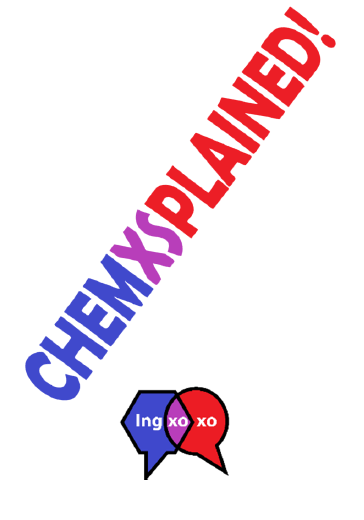

# Chemxsplained 

 
Code and artwork for the chemxsplained game

# Cards 
under cards
generate shuffled words in xls from a csv list by using random_to_csv.ipynb
use the mailings document to import the xls and generate 100 card. These can be printed to A5 PDF.

# Gameboard
under gameboard-artwork.
This is an svg edited using Inkscape

# Rules
under rules
the rules of the game/

# Contributors

- Idea and first prototype of game, cards and rules by `Students who joined as part of the Ingxoxo research week and create this content under open license:
  - insert student names (just double checking everyone ok with this)
- Playtesting by students. Further playtesting by S. Renga
- Code, mailings, design in svg format and all further updates by @chrisbarnettster and C. Edmonds-Smith (Ingxoxo PI's)

# LICENSE

- Code is licensed [MIT](https://choosealicense.com/licenses/mit/)
- Artwork, images and game assets are licensed  [CC-BY-4.0](https://choosealicense.com/licenses/cc-by-sa-4.0/)
- Any unintentionally shared data of a private nature and containing personal information is private and may not be copied or distributed.

